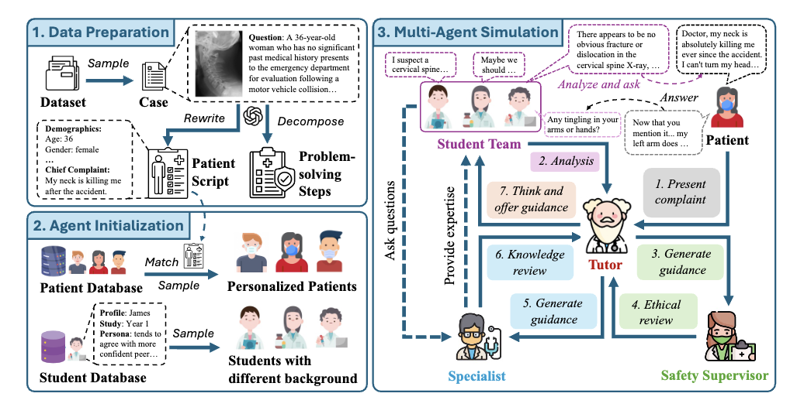
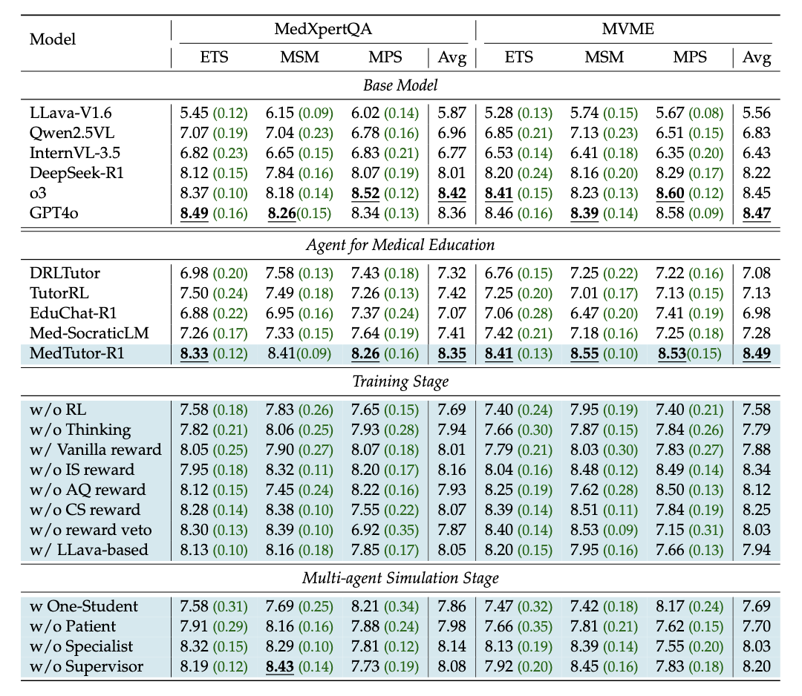

<div align="center">

# MedTutor-R1: Socratic Personalized Medical Teaching with Multi-Agent Simulation

</div>

<div align="center">
<b><a href="https://scholar.google.com/citations?user=ULvoYXgAAAAJ&hl=zh-CN" target="_blank">Zhitao He</a>,
<a href="https://github.com/Zhitao-He/MedTutor-R1" target="_blank"> Haolin Yang</a>,
 <a href="https://mayrfung.github.io/" target="_blank">Yi R. (May) Fung</a></b>


<sup></sup> Hong Kong University of Science and Technology

[](https://arxiv.org/abs/2505.23224)
[](https://huggingface.co/datasets/Zhitao-He/MMBoundary)

</div>

<br>

---


## Introduction

The significant gap between rising demands for clinical training and the scarcity of expert instruction poses a major challenge to medical education. With powerful capabilities in personalized guidance, Large Language Models (LLMs) offer a promising solution to bridge this gap. However, current research focuses mainly on one-on-one knowledge instruction, overlooking collaborative reasoning, a key skill for students developed in teamwork like ward rounds. To this end, we develop ClinEdu, a multi-agent pedagogical simulator with personality-driven patients and diverse student cohorts, enabling controlled testing of complex pedagogical processes and scalable generation of teaching data. Based on ClinEdu, we construct ClinTeach, a large Socratic teaching dialogue dataset that captures the complexities of group instruction. We then train MedTutor-R1, the first multimodal Socratic tutor designed for one-to-many instruction in clinical medical education. MedTutor-R1 is first instruction-tuned on our ClinTeach dataset and then optimized with reinforcement learning, using rewards derived from a three-axis rubric, covering structural fidelity, analytical quality, and clinical safety, to refine its adaptive Socratic strategies. For authentic in-situ assessment, we use simulation-based interactive evaluation that redeploys the tutor back into ClinEdu. Experimental results demonstrate that our MedTutor-R1 outperforms the base model by over 20% in average pedagogical score and is comparable to o3, while also exhibiting high adaptability in handling a scaling number of students. This promising performance underscores the effectiveness of our pedagogical simulator, ClinEdu.

---

<div align="center">
<h3> Our ClinEdu framework for clinical ward rounds simulation. </h3>

</div>

The system first samples a case from the original dataset, which is then decomposed and used to create a patient script. Based on this script, a suitable patient prototype is selected from the patient database. A team of students with diverse backgrounds is then randomly assembled. The simulation comprises student analysis, tutor guidance and review, and student query and exploration.

<div align="center">
<h3>Experimental Results</h3>

</div>

Performance comparison on various datasets and ablation study of our model. We report
the mean performance over three independent runs of the automatic interactive evaluation,
with the corresponding standard deviation indicated by the The best result is bolded.

---

## Environment setup

- **Git clone:**

```bash
git clone https://github.com/Zhitao-He/MedTutor-R1.git
cd MedTutor-R1
```

- **Create a conda environment:**

```bash
conda create -n MedTutor-R1 python=3.10
conda activate MedTutor-R1
pip install -r requirements.txt
```

## Question decomposition

```bash
# breaking down the question into multiple sub-questions for Socratic education
python question_decomposition/problem_decomposition.py
```

## Patient Agent

```bash
# patient database
python Patient_simulate/construct_database.py

# patient scripts
python Patient_simulate/construct_script_MM_test.py
```

## Student Agent

```bash
# student database
Student_simulate/construct_student_database.py
```

## ClinEdu

```bash
# Instructions for agents
Execution/Agent_prompt/student_action.txt
Execution/Agent_prompt/student_analysis.txt
Execution/Agent_prompt/teacher_guidance.txt

# Start evironment 
python Execution/agentic_framework.py
```

## Training

```bash
# Stage 1：Instruction-Tuning for Socratic Teaching
cd SFT
llamafactory-cli train examples/train_lora/qwen2_5vl_lora_sft_medical.yaml
llamafactory-cli export examples/merge_lora/qwen2_5vl_lora_sft.yaml

# Stage 2: Reinforcement Learning with Rubric Criterion
cd ../EasyR1
bash examples/qwen2_5_vl_7b_AItutor_grpo.sh
```


## Evaluation

```bash
# Placing the AI tutor back into the ClinEdu environment for testing yielded the conversation records.
# test data
Evaluation/Eval_dataset/MedXpertQA/MedXpert_patient_script_MM_for_test.json

# eval
python Evaluation/Judgement/automated_eval_result.py

```

## Citation

```bibtex
@misc{he2025medtutor-r1,
      title={MedTutor-R1: Socratic Personalized Medical Teaching
with Multi-Agent Simulation}, 
      author={Zhitao He and Haolin Yang and Yi R. Fung},
      year={2025},
      eprint={2505.23224},
      archivePrefix={arXiv},
      primaryClass={cs.CL},
      url={https://arxiv.org/abs/2505.23224}, 
}
```

## License

**Code:** Licensed under the [Apache 2.0 License](LICENSE).
 **Dataset:** Licensed under the [CC BY-NC 4.0 License](https://creativecommons.org/licenses/by-nc/4.0/).
 

